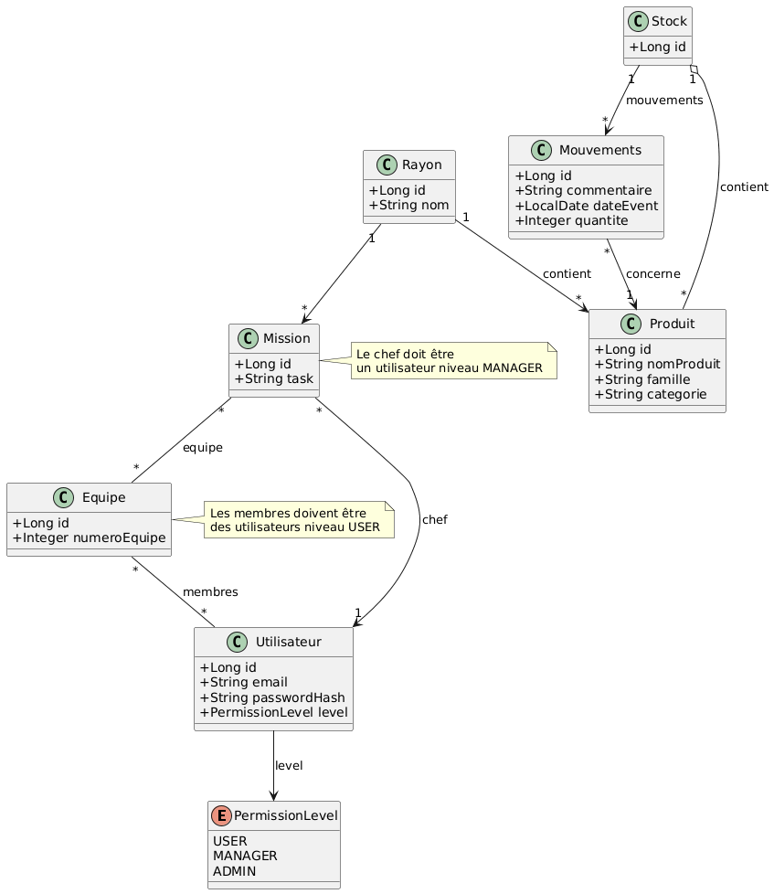

# Site Gestion de Stock

> **MEMBRES DU GROUPE :**
> - **BLAIN Antoine**
> - **PECONTAL Corentin** 
> - **MARTIN Evan**

---

## Présentation du Projet
Dans ce projet, nous allons créer un site site de gestion de stock, permettant de suivre les mouvements d’entrée et de sortie de produits, tout en répartissant les équipes et les missions associées. Le modèle repose sur plusieurs entités principales telles que les produits, les utilisateurs, les stocks, les équipes et les missions, ainsi que les mouvements d’entrée/sortie qui permettent de tracer les quantités manipulées. Chaque utilisateur possède un niveau de permission (utilisateur, manager ou administrateur) afin de contrôler les accès et responsabilités, notamment pour la gestion des équipes et la désignation des chefs de mission. Le système intègre également une organisation des produits par catégorie et par rayon, facilitant leur localisation et leur gestion.

**Fonctionnalités principales :**
* Authentification utilisateur
* Créer / modifier / supprimer un compte
* Créer / modifier / supprimer un mouvement
* Voir historique des mouvements
* Voir les stocks
* Rechercher des mouvements
* Rechercher des produits (stockés ou non)
* Envoyer des notifications à certains seuils de stockage
* Planifier des notifications lorsqu'un certain produit devient disponible ou indisponible
* Répartir les utilisateurs entre différentes équipes
* Répartir les équipes entre différentes missions
* Répartir les missions entre différents rayons
* Créer / modifier / supprimer une équipe 
* Créer / modifier / supprimer une mission
* Créer / modifier / supprimer un rayon

## Etape 1 : découpage modulaire 

| Module        | Fonctionnalités incluses |
|--------------|--------------------------|
| Inventaire   | - Voir les stocks   - Rechercher des produits (stockés ou non) |
| Suivi        | - Créer / modifier / supprimer un mouvement   - Voir historique des mouvements   - Rechercher des mouvements |
| Utilisateurs | - Authentification utilisateur   - Créer / modifier / supprimer un compte |
| Notifications| - Envoyer des notifications à certains seuils de stockage   - Planifier des notifications lorsqu'un produit devient disponible ou indisponible |
| Équipe       | - Créer / modifier / supprimer une équipe   - Répartir les utilisateurs entre différentes équipes |
| Mission      | - Créer / modifier / supprimer une mission   - Répartir les équipes entre différentes missions |
| Rayon        | - Créer / modifier / supprimer un rayon   - Répartir les missions entre différents rayons |

## Les Classe 
* Mouvement
- Long id
- String commentaire
- LocalDate dateEvent
- Integer quantite
- Produit produit

* Utilisateur
- Long id
- String email
- String passwordHash
- PermissionLevel permissionLevel
- Integer level (1 = user; 2 = manager; 3 = admin)

* Produit
- Long id
- String nomProduit
- String famille
- String categorie

* Stock
- Long id
- Produit[] produits
- Mouvement[] entrees

* Equipe
- Long id
- Integer numeroEquipe
- Utilisateur[] membres

* Mission
- Long id
- Equipe[] equipes
- Utilisateur chef
- String task
- Rayon rayon

* Rayon
- Long id
- String nom
- Produit[] produits

## Architecture Technique
Architecture du Projet : 
