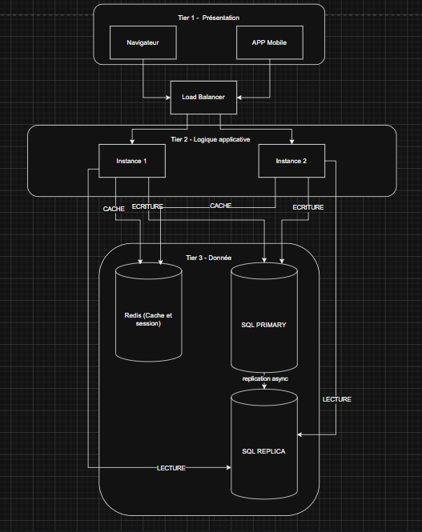

# Site Gestion de Stock

> **MEMBRES DU GROUPE :**
> - **BLAIN Antoine**
> - **PECONTAL Corentin** 
> - **MARTIN Evan**

---
## Nom de l'application 
Inv&Stock

## Présentation du Projet
Dans ce projet, nous allons créer un site site de gestion de stock, permettant de suivre les mouvements d’entrée et de sortie de produits, tout en répartissant les équipes et les missions associées. Le modèle repose sur plusieurs entités principales telles que les produits, les utilisateurs, les stocks, les équipes et les missions, ainsi que les mouvements d’entrée/sortie qui permettent de tracer les quantités manipulées. Chaque utilisateur possède un niveau de permission (utilisateur, manager ou administrateur) afin de contrôler les accès et responsabilités, notamment pour la gestion des équipes et la désignation des chefs de mission. Le système intègre également une organisation des produits par catégorie et par rayon, facilitant leur localisation et leur gestion.

**Fonctionnalités principales :**
* Authentification utilisateur
* Créer / modifier / supprimer un compte
* Créer / modifier / supprimer un mouvement
* Voir historique des mouvements
* Voir les stocks
* Rechercher des mouvements
* Rechercher des produits (stockés ou non)
* Envoyer des notifications à certains seuils de stockage
* Planifier des notifications lorsqu'un certain produit devient disponible ou indisponible
* Répartir les utilisateurs entre différentes équipes
* Répartir les équipes entre différentes missions
* Répartir les missions entre différents rayons
* Créer / modifier / supprimer une équipe 
* Créer / modifier / supprimer une mission
* Créer / modifier / supprimer un rayon

## Découpage modulaire 

| Module        | Fonctionnalités incluses |
|--------------|--------------------------|
| Inventaire   | - Voir les stocks   - Rechercher des produits (stockés ou non) |
| Suivi        | - Créer / modifier / supprimer un mouvement   - Voir historique des mouvements   - Rechercher des mouvements |
| Utilisateurs | - Authentification utilisateur   - Créer / modifier / supprimer un compte |
| Notifications| - Envoyer des notifications à certains seuils de stockage   - Planifier des notifications lorsqu'un produit devient disponible ou indisponible |
| Équipe       | - Créer / modifier / supprimer une équipe   - Répartir les utilisateurs entre différentes équipes |
| Mission      | - Créer / modifier / supprimer une mission   - Répartir les équipes entre différentes missions |
| Rayon        | - Créer / modifier / supprimer un rayon   - Répartir les missions entre différents rayons |

## Les Classes 
### Mouvement
- Long id
- String commentaire
- LocalDate dateEvent
- Integer quantite
- Produit produit

### Utilisateur
- Long id
- String email
- String passwordHash
- PermissionLevel permissionLevel
- Integer level (1 = user; 2 = manager; 3 = admin)

### Produit
- Long id
- String nomProduit
- String famille
- String categorie

### Stock
- Long id
- Produit[] produits
- Mouvement[] entrees

### Equipe
- Long id
- Integer numeroEquipe
- Utilisateur[] membres

### Mission
- Long id
- Equipe[] equipes
- Utilisateur chef
- String task
- Rayon rayon

### Rayon
- Long id
- String nom
- Produit[] produits

## Composants techniques 
### Authentification
- Interface d'entrée → Recevoir les informations de l'utilisateur
- Authentification → Vérifier la conformité des informations renseignées
- Connexion → Connecter l'utilisateur à son compte
### Créer / modifier / supprimer un compte
- Interface d'entrée → Recevoir la requête
- Logique métier → Valider la conformité des données renseignées
- Persistance → Sauvegarder l'ajout ou la modification  
 → Idem pour les mouvements, missions, équipes et rayons
### Voir historique des mouvements
- Interface d'entrée → Recevoir la requête de recherche et les filtres apposés
- Logique métier → Valider la conformité de la requête
- Filtrage → Sélectionner les informations à partir de la requête
- Affichage → Afficher l'historique des mouvements  
→ Idem pour voir les stocks
### Répartir les utilisateurs entre différentes équipes
- Interface d'entrée → Recevoir la requête d'attribution
- Logique métier → Valider la conformité de la requête
- Persistance → Sauvegarder la modification  
→ Idem pour répartir les équipes entre les missions et les missions entre les rayons
### Planifier les notifications
- Interface d'entrée → Recevoir la requête de planification de notification
- Logique métier → Valider la conformité de la notification
- Persistance → Sauvegarder la notification
### Envoyer des notifications à certains seuils de stockage
- Entrée → Recevoir l'évolution des niveaux de stockage
- Surveillance → Comparer les niveaux aux seuils critiques renseignés
- Notification → Envoyer une notification aux utilisateurs concernés si nécessaire

## Patterns architecturaux

* StockRepository      	← accès aux données / Repository
* SearchService	        ← recherche produit / CQRS (permet de  rechercher et affichage) 

* MovementRepository   	← gestion des mouvement / Repository
* HistoryService       	← historique des événements / Event-Driven (réagit à un événement (quantité > )

* AuthService           	← authentification / Strategy (comportement dynamique)
* Access		        	← gestion des rôles / Strategy (comportement dynamique)
* Permission   			← contrôle d’accès / Decorator (ajouter des règles)

* StockAlert        		← événement / Observer (notifier automatiquement)
* NotificationListener   	← consommateur / Event-Driven (réagir aux événements)
* NotificationScheduler  	← planification / Scheduler (exécuter plus tard)

* TeamRepository   		← gestion équipes / Repository
* TeamService    		    ← logique métier / agregate (un bloc cohérent piloté par équipe/Team)

* MissionService     		← logique métier / State Machine (gère les états)
* MissionState      		← gestion états / State Machine (gère les états)
* MissionSaga        		← multiple étape / SAGA (Créée, Assignée, En cours, Terminée)

* ShelfRepository   		← gestion rayons / Repository

## Architecture Technique
Architecture du Projet : 

Architecture N-Tier Projet : 

## MicroService
Notre système étant basé sur une architecture 3-tiers, il n’intègre pas de couche Gateway, généralement présente dans les architectures 4-tiers. Donc ces éléments ne nous impactent pas.

## Acteurs :
Entité commanditaire : IPSSI  
Product owner : Mostapha Bachir ADDI  
SCRUM master : Antoine BLAIN  
Équipe de développement :  
* Evan MARTIN  
* Corentin PECONTAL  
Équipe de test :  
* Evan MARTIN  
* Corentin PECONTAL  
Designer UI/UX : Romain MOREAU  
Magasins utilisateurs finaux  
Parties prenantes :  
Équipe de support client pour gérer les retours de bug des utilisateurs.
## Outils et protocoles
### Outils de développement
Visual Studio Code / PHPStorm pour le développement.
Figma pour le prototypage de l'interface utilisateur.
Stitch pour un aperçu d’idée de maquette.
### Gestion de versions
Utilisation de Git pour la gestion de versions du code source.
### Sécurité des données
Mise en place de protocoles de sécurité standard pour protéger les données des utilisateurs : 
    - Certificat SSL
    - Token
    - Hachage des mots de passe / des données sensibles
    - Respect du RGPD (respect des droits de l’utilisateur)
